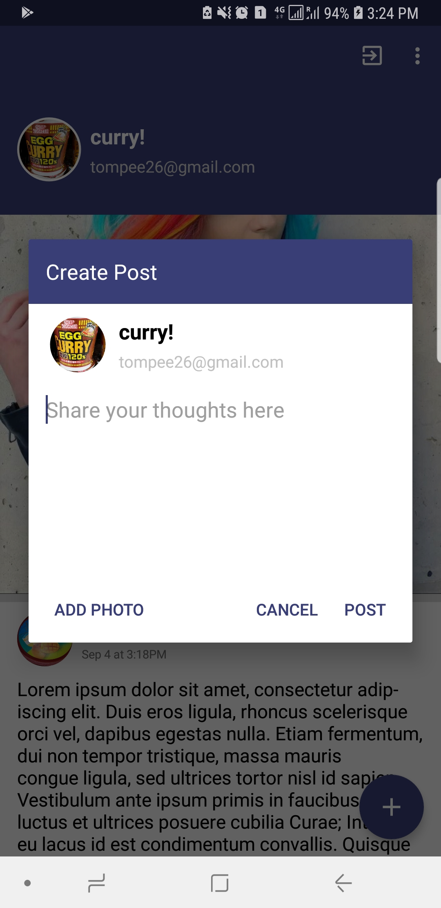

# Twitlet - Share your thoughts!
# Features
- Create your own account
 

- Create a profile


- Add/Delete a post to a collective timeline
 

- View the collective timeline / individual posts
 

# Getting Started

## Prerequisites
The following tools are required to build the project.
```
Android Studio v3.1.4
```
This project was created using the following services and technologies
```
1. Kotlin (runtime v1.2.51)
2. Android SDK (min 17)
3. Firebase
```

# Building
Note: This app was built using Firebase as backend. You may plug your own firebase instance by creating a firebase account, and replacing the `google-services.json` file under the `app/` directory. Take note that this project requires the following firebase services
```
1. Firebase authentication
2. Firestore database
3. Firebase storage
```
Alternatively, if you want to build it using the default firebase instance, you need to generate a the SHA-1 of the signing certificate. For more information, check [here](https://developers.google.com/android/guides/client-auth). After generating the SHA-1, contact the developer [here](mailto:tompee26@gmail.com).

A debug APK is also provided in release for easier evaluation.

To build and test the project
1. Clone this repository
2. Import the project in Android Studio and sync gradle files
3. Connect a Android device or use an emulator
4. 'Run app' to perform build and install.
